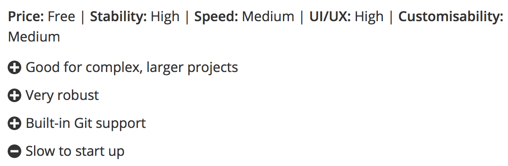
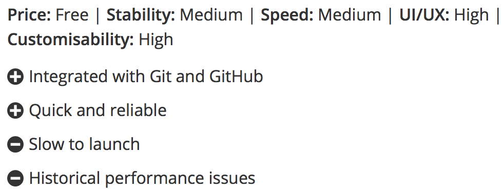
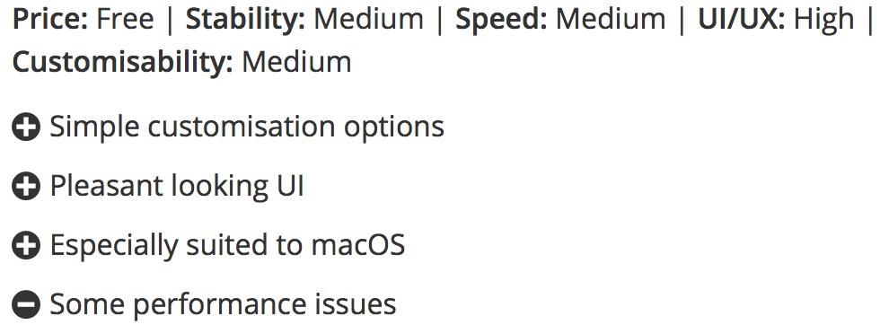

# 1. Visual Studio Code

## Why did they build it?
Visual Studio Code combines the simplicity of a *source code editor* with powerful developer tooling, like IntelliSense code completion and debugging.

**First and foremost**, it is an editor that gets out of your way. The delightfully frictionless edit-build-debug cycle means less time fiddling with your environment, and more time executing on your ideas.

## On what systems does it run?
* macOS
* Windows 
* Linux

## Personalization and plugins 
>Customize every feature to your liking and install any number of third-party extensions. 

While most scenarios work "out of the box" with no configuration, VS Code also grows with you, optimize your experience to suit your unique needs. 

VS Code is an open source project so you can also contribute to the growing and vibrant community on GitHub.

ps: most used plugins are all free 

# 2. Atom 

## Everything you can expect
* Cross platform editing
   * [Atom](https://atom.io) works across operating systems. Use it on OS X, Windows, or Linux.

* Build-in package manager
    * Search for and install new packages or create your own right from Atom.

* Smart autocompletion
    * Atom helps you write code faster with a smart and flexible autocomplete.

* find and replace
    * Find, preview, and replace text as you type in a file or across all your projects.

# 3. Brackets

## Why Use Brackets?

* Brackets is a lightweight, yet powerful, modern text editor. They blend visual tools into the editor so you get the right amount of help when you want it without getting in the way of your creative process. 
##Live preview
* get a real-time connection to your browser. Make changes to CSS and `<HTML>` and you'll instantly see those changes on screen. 
Also see where your CSS selector is being applied in the browser by simply putting your cursor on it. 

## Inline Editors
* Instead of jumping between file tabs, Brackets lets you open a window into the code you care about most. 
Want to work on the CSS that applies to a specific ID? Put your mouse cursor on that ID, push Command / Ctrl+E and Brackets will show
 you all the CSS selectors with that ID in an inline window so you can work on your code side-by-side without any popups.

 # summary 
 IDE | Website
------------ | -------------
Visual Studio Code| [VSC](https://code.visualstudio.com)
Atom | [Atom](https://atom.io)
Brackets | [Brackets](http://brackets.io)

I hope this was helpfull :raised_hands:
